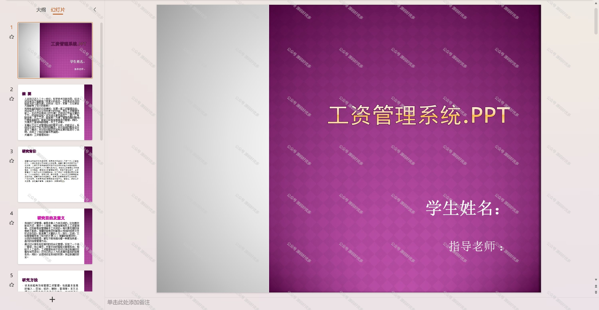

 
## 查看主页获取源码

### 一、作品包含

源码+数据库+设计文档万字+PPT+全套环境和工具资源+部署教程

### 二、项目技术

前端技术：Html、Css、Js、Vue、Element-ui

数据库：MySQL

后端技术：Java、Spring Boot、MyBatis

  

### 三、运行环境

开发工具：IDEA/eclipse

数据库：MySQL5.7

数据库管理工具：Navicat10以上版本

环境配置软件： JDK1.8+Maven3.6.3

前端Nodejs：14

### 四、项目介绍
项目编号：springbootA182

工资管理系统是为了帮助企业高效、准确地处理员工薪酬计算和发放问题而设计的，减少了人力资源部门的重复劳动，确保了员工工资的及时准确发放，同时也为企业提供了工资成本控制和财务规划的重要工具。

系统分为管理员和员工
管理员的功能：系统首页、个人中心、员工管理、部门管理、考勤信息管理、员工工资管理、留言管理。
员工的功能：系统首页、个人中心、考勤信息管理、员工工资管理、留言管理。

### 五、运行截图

  
